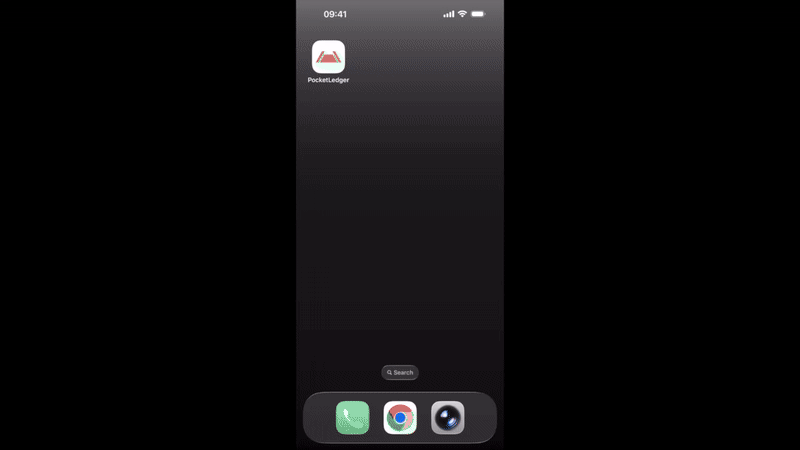

# PocketLedger

A personal expense tracker demonstrating a single-codebase architecture that runs on web, desktop, and mobile from the same server-rendered HTML. Includes **two backend implementations** — Clojure and TypeScript — sharing the same Tauri shell, database, and UI.

## Architecture

```
Server (Clojure or TypeScript) → HTML + SSE → Datastar (reactivity) → Ty (web components) → Browser / Tauri
```

- **Clojure** or **TypeScript** handles all business logic, routing, and HTML rendering
- **[Datastar](https://data-star.dev/)** provides client-side reactivity via SSE — no client-side framework needed
- **[Ty](https://gersak.github.io/ty/)** web components (`@gersak/ty`) provide the UI layer — framework-agnostic, works everywhere
- **[Tauri](https://tauri.app/)** wraps the same web content into native desktop and mobile apps
- **SQLite** stores data locally (shared `pocketledger.db` at repo root)

There is no separate API layer. The server renders HTML fragments and pushes them to the client over Server-Sent Events. Datastar morphs the DOM. The entire frontend is server-driven.

## Demo

<p align="center">
  
</p>

## Getting Started

Choose your backend — each guide covers web, desktop, Android, and iOS:

- **[Clojure](clj/README.md)** — http-kit on port 3000
- **[TypeScript](ts/README.md)** — Hono on port 3000

Both implementations are functionally equivalent.

## Project Structure

```
ty-pocketledger/
├── clj/                        # Clojure server (port 3000)
│   ├── README.md               # → Clojure setup & development
│   ├── src/pocketledger/
│   ├── dev/
│   └── deps.edn
├── ts/                         # TypeScript server (port 3000)
│   ├── README.md               # → TypeScript setup & development
│   ├── src/
│   ├── package.json
│   └── tsconfig.json
├── src-tauri/                  # Shared Tauri shell
│   ├── tauri.conf.json         # Base config
│   ├── tauri.clj.conf.json     # Clojure dev override
│   └── tauri.ts.conf.json      # TypeScript dev override
├── docs/
├── pocketledger.db             # Shared SQLite database
└── README.md
```

## Production Deployment

Since this is a server-rendered app, Tauri bundles a minimal `index.html` that redirects to your production server:

```
src-tauri/dist/index.html → redirect → https://your-production-server.com
```

The server (Clojure or TypeScript) must be accessible over HTTPS. For production:
1. Deploy your server (VPS, cloud, etc.)
2. Update `src-tauri/dist/index.html` with the production URL
3. Build release: `cargo tauri ios build` / `cargo tauri android build`
